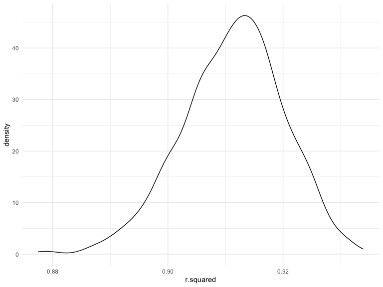
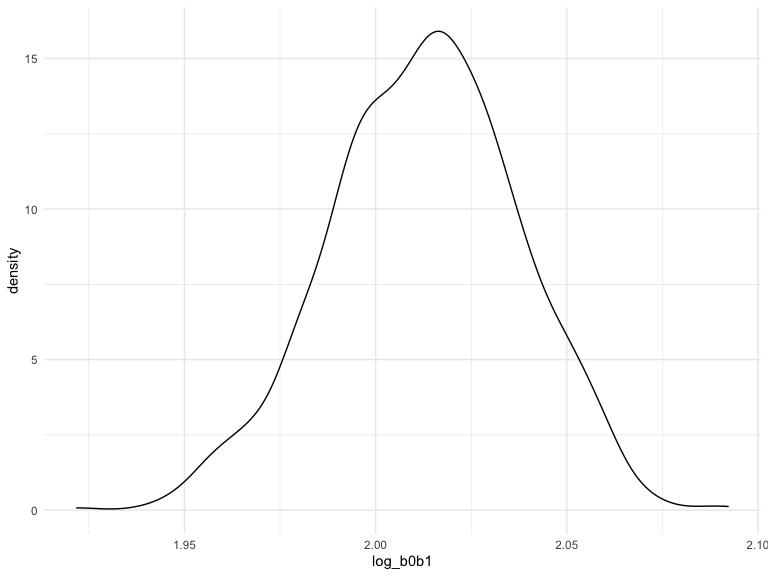
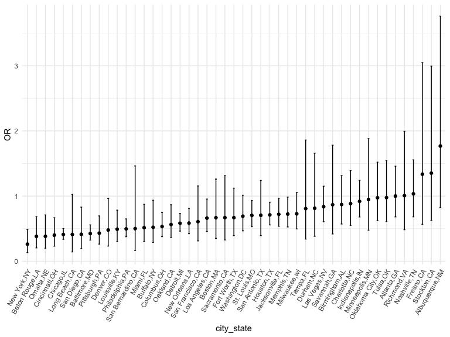
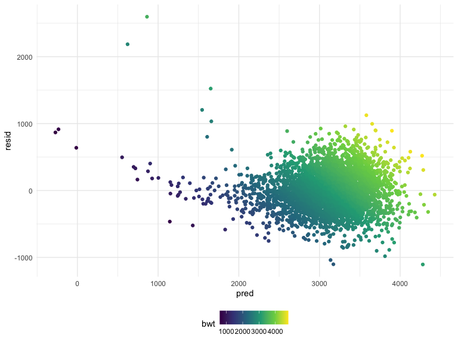
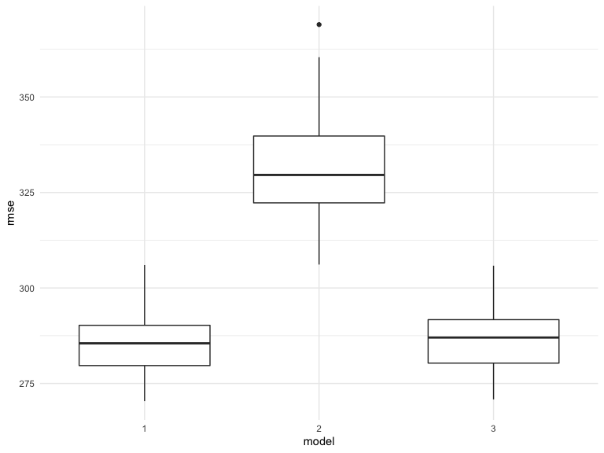

p8105_hw6_zx2424
================
Zhaoqianyu Xiong
2022-11-26

## Problem 1

``` r
weather_df = 
  rnoaa::meteo_pull_monitors(
    c("USW00094728"),
    var = c("PRCP", "TMIN", "TMAX"), 
    date_min = "2017-01-01",
    date_max = "2017-12-31") %>%
  mutate(
    name = recode(id, USW00094728 = "CentralPark_NY"),
    tmin = tmin / 10,
    tmax = tmax / 10) %>%
  select(name, id, everything())
```

    ## Registered S3 method overwritten by 'hoardr':
    ##   method           from
    ##   print.cache_info httr

    ## using cached file: ~/Library/Caches/R/noaa_ghcnd/USW00094728.dly

    ## date created (size, mb): 2022-09-29 10:32:05 (8.401)

    ## file min/max dates: 1869-01-01 / 2022-09-30

``` r
weather_df %>% 
  modelr::bootstrap(n = 1000) %>% 
  mutate(
    models = map(strap, ~lm(tmax ~ tmin, data = .x) ),
    results = map(models, broom::glance)) %>% 
  select(-strap, -models) %>% 
  unnest(results) %>% 
  ggplot(aes(x = r.squared)) + geom_density()
```



In this example, the $\hat{r}^2$ value is high, and the upper bound at 1
may be a cause for the generally skewed shape of the distribution. If we
wanted to construct a confidence interval for $R^2$, we could take the
2.5% and 97.5% quantiles of the estimates across bootstrap samples.
However, because the shape isn’t symmetric, using the mean +/- 1.96
times the standard error probably wouldn’t work well.

We can produce a distribution for $\log(\beta_0 * \beta1)$ using a
similar approach, with a bit more wrangling before we make our plot.

``` r
weather_df %>% 
  modelr::bootstrap(n = 1000) %>% 
  mutate(
    models = map(strap, ~lm(tmax ~ tmin, data = .x) ),
    results = map(models, broom::tidy)) %>% 
  select(-strap, -models) %>% 
  unnest(results) %>% 
  select(id = `.id`, term, estimate) %>% 
  pivot_wider(
    names_from = term, 
    values_from = estimate) %>% 
  rename(beta0 = `(Intercept)`, beta1 = tmin) %>% 
  mutate(log_b0b1 = log(beta0 * beta1)) %>% 
  ggplot(aes(x = log_b0b1)) + geom_density()
```



As with $r^2$, this distribution is somewhat skewed and has some
outliers.

The point of this is not to say you should always use the bootstrap –
it’s possible to establish “large sample” distributions for strange
parameters / values / summaries in a lot of cases, and those are great
to have. But it is helpful to know that there’s a way to do inference
even in tough cases.

## Problem 2

Import and clean the data.

``` r
homicide = 
  read_csv("data/homicide-data.csv") %>% 
  janitor::clean_names() %>%
  mutate(city_state = str_c(city, sep = ",", state)) %>%
  mutate(status = ifelse(disposition == "Closed by arrest", "1", "0")) %>%
  mutate(status = as.integer(status)) %>%
  filter(city_state != "Dallas,TX") %>%
  filter(city_state != "Phoenix,AZ") %>%
  filter(city_state != "Kansas City,MO") %>%
  filter(city_state != "Tulsa,AL") %>%
  filter(victim_race == "White" | victim_race == "Black") %>%
  mutate(victim_age = as.numeric(victim_age)) %>%
  filter(victim_sex == "Male" | victim_sex == "Female")
```

    ## Rows: 52179 Columns: 12
    ## ── Column specification ────────────────────────────────────────────────────────
    ## Delimiter: ","
    ## chr (9): uid, victim_last, victim_first, victim_race, victim_age, victim_sex...
    ## dbl (3): reported_date, lat, lon
    ## 
    ## ℹ Use `spec()` to retrieve the full column specification for this data.
    ## ℹ Specify the column types or set `show_col_types = FALSE` to quiet this message.

Fit a logistic regression with resolved vs unresolved as the outcome and
victim age, sex and race as predictors for Baltimore, MD. And save the
output as R object “Baltimore_fit”.

``` r
Baltimore_df = homicide %>%
  filter(city_state == "Baltimore,MD") %>%
  select(status, victim_race, victim_sex, victim_age)

Baltimore_fit = 
  Baltimore_df %>%
  glm(status ~ victim_age + victim_sex + victim_race, data = ., family = binomial())
```

Apply broom::tidy() to this object.

``` r
broom::tidy(Baltimore_fit)
```

    ## # A tibble: 4 × 5
    ##   term             estimate std.error statistic  p.value
    ##   <chr>               <dbl>     <dbl>     <dbl>    <dbl>
    ## 1 (Intercept)       0.310     0.171        1.81 7.04e- 2
    ## 2 victim_age       -0.00673   0.00332     -2.02 4.30e- 2
    ## 3 victim_sexMale   -0.854     0.138       -6.18 6.26e-10
    ## 4 victim_raceWhite  0.842     0.175        4.82 1.45e- 6

Obtain the estimate keeping all other variables fixed. The estimated OR
for solving homicides comparing male victims to female victims is 0.426.

``` r
 Baltimore_fit %>%
  broom::tidy() %>%
  select(term, estimate) %>%
  mutate(OR = exp(estimate)) %>%
  filter(term == "victim_sexMale")
```

    ## # A tibble: 1 × 3
    ##   term           estimate    OR
    ##   <chr>             <dbl> <dbl>
    ## 1 victim_sexMale   -0.854 0.426

Obtain the adjusted confidence interval of adjusted odds ratio keeping
all other variables fixed. The 95% confidence interval is from 0.32 to
0.56.

``` r
exp(confint(Baltimore_fit)) 
```

    ## Waiting for profiling to be done...

    ##                      2.5 %    97.5 %
    ## (Intercept)      0.9757573 1.9107826
    ## victim_age       0.9868059 0.9997539
    ## victim_sexMale   0.3241908 0.5575508
    ## victim_raceWhite 1.6496269 3.2759334

Write a function to get both OR and CI at the same time.

``` r
OR_and_CI =
  function(fit){
    df_1 = fit %>%
      broom::tidy() %>%
      filter(term == "victim_sexMale")

    df_2 = fit %>%
      confint() %>%
      exp() %>%
      as_tibble() 
    
    tibble(
      OR = exp(df_1$estimate),
      Conf_low = as.numeric(df_2[3,1]),
      Conf_high = as.numeric(df_2[3,2])
    )
      }
```

Run glm for each cities in my dataset. And extract the adjusted odds
ratio (and CI) for solving homicides comparing male victims to female
victims.

``` r
all_fit = homicide %>%
  select(city_state, status, victim_race, victim_sex, victim_age) %>%
  nest(data = -city_state) %>%
  mutate(
    models = map(data, ~glm(status ~ victim_age + victim_sex + victim_race, data = ., family = binomial())),
    results = map(models, OR_and_CI)) %>%
  select(-data, -models) %>%
  unnest(results)
```

    ## Waiting for profiling to be done...
    ## Waiting for profiling to be done...
    ## Waiting for profiling to be done...
    ## Waiting for profiling to be done...
    ## Waiting for profiling to be done...
    ## Waiting for profiling to be done...
    ## Waiting for profiling to be done...
    ## Waiting for profiling to be done...
    ## Waiting for profiling to be done...
    ## Waiting for profiling to be done...
    ## Waiting for profiling to be done...
    ## Waiting for profiling to be done...
    ## Waiting for profiling to be done...
    ## Waiting for profiling to be done...
    ## Waiting for profiling to be done...
    ## Waiting for profiling to be done...
    ## Waiting for profiling to be done...
    ## Waiting for profiling to be done...
    ## Waiting for profiling to be done...
    ## Waiting for profiling to be done...
    ## Waiting for profiling to be done...
    ## Waiting for profiling to be done...
    ## Waiting for profiling to be done...
    ## Waiting for profiling to be done...
    ## Waiting for profiling to be done...
    ## Waiting for profiling to be done...
    ## Waiting for profiling to be done...
    ## Waiting for profiling to be done...
    ## Waiting for profiling to be done...
    ## Waiting for profiling to be done...
    ## Waiting for profiling to be done...
    ## Waiting for profiling to be done...
    ## Waiting for profiling to be done...
    ## Waiting for profiling to be done...
    ## Waiting for profiling to be done...
    ## Waiting for profiling to be done...
    ## Waiting for profiling to be done...
    ## Waiting for profiling to be done...
    ## Waiting for profiling to be done...
    ## Waiting for profiling to be done...
    ## Waiting for profiling to be done...
    ## Waiting for profiling to be done...
    ## Waiting for profiling to be done...
    ## Waiting for profiling to be done...
    ## Waiting for profiling to be done...
    ## Waiting for profiling to be done...
    ## Waiting for profiling to be done...

``` r
all_fit
```

    ## # A tibble: 47 × 4
    ##    city_state        OR Conf_low Conf_high
    ##    <chr>          <dbl>    <dbl>     <dbl>
    ##  1 Albuquerque,NM 1.77     0.825     3.76 
    ##  2 Atlanta,GA     1.00     0.680     1.46 
    ##  3 Baltimore,MD   0.426    0.324     0.558
    ##  4 Baton Rouge,LA 0.381    0.204     0.684
    ##  5 Birmingham,AL  0.870    0.571     1.31 
    ##  6 Boston,MA      0.667    0.351     1.26 
    ##  7 Buffalo,NY     0.521    0.288     0.936
    ##  8 Charlotte,NC   0.884    0.551     1.39 
    ##  9 Chicago,IL     0.410    0.336     0.501
    ## 10 Cincinnati,OH  0.400    0.231     0.667
    ## # … with 37 more rows

Create a plot that shows the estimated ORs and CIs for each city. From
the plot, we can discover that the odds ratios for solving homicides
comparing male victims to female victims of most cities are less than 1,
it means that the homicides in which male is less likely to be resolved
than those in which the victim is female. Although the situation
reverses in Fresno, CA; Stockton, CA; Albuquerque, NM, their confidence
intervals are extremely wide, which means that the situation differs for
different cases.

``` r
all_fit %>%
  mutate(city_state = fct_reorder(city_state, OR)) %>%
  ggplot(aes(x = city_state, y = OR)) +
  geom_point() +
  geom_errorbar(aes(ymin = Conf_low, ymax = Conf_high), width = 0.2) +
  theme(axis.text.x = element_text(angle = 60, hjust = 1))
```



## Problem 3

Load and clean the data for regression analysis.

``` r
birthweight = read_csv("data/birthweight.csv") %>%
  drop_na() %>%
  mutate(babysex = ifelse(babysex == 1, "male", "female"),
         babysex = fct_relevel(babysex, "male"),
         malform = as.character(malform),
         malform = as.factor(malform)) %>%
  select(bwt, everything())
```

    ## Rows: 4342 Columns: 20
    ## ── Column specification ────────────────────────────────────────────────────────
    ## Delimiter: ","
    ## dbl (20): babysex, bhead, blength, bwt, delwt, fincome, frace, gaweeks, malf...
    ## 
    ## ℹ Use `spec()` to retrieve the full column specification for this data.
    ## ℹ Specify the column types or set `show_col_types = FALSE` to quiet this message.

Use LASSO to choose predictors. When lamba reach 60, there are only
three predictors left to be non-zero, which are “bhead”, “blength”, and
“gaweeks”.So I will use these three predictors to fit my regression
model.

``` r
bwt_fit = glmnet(as.matrix(birthweight[2:20]), birthweight$bwt, lambda = 60)
coef(bwt_fit)
```

    ## 20 x 1 sparse Matrix of class "dgCMatrix"
    ##                       s0
    ## (Intercept) -4616.554587
    ## babysex         .       
    ## bhead         122.266044
    ## blength        71.035735
    ## delwt           .       
    ## fincome         .       
    ## frace           .       
    ## gaweeks         2.093357
    ## malform         .       
    ## menarche        .       
    ## mheight         .       
    ## momage          .       
    ## mrace           .       
    ## parity          .       
    ## pnumlbw         .       
    ## pnumsga         .       
    ## ppbmi           .       
    ## ppwt            .       
    ## smoken          .       
    ## wtgain          .

Make a linear regression model and show a plot of model residuals
against fitted values. Although there are some outliers, most points are
close to 0 on y-axis.

``` r
bwt_1 = lm(bwt ~ bhead + blength + gaweeks, data = birthweight)
birthweight %>%
  add_residuals(bwt_1) %>%
  add_predictions(bwt_1) %>%
  ggplot(aes(x = pred, y = resid, color = bwt)) + geom_point()
```



Fit other two linear regressions as request.

``` r
bwt_2 = lm(bwt ~ blength + gaweeks, data = birthweight)
bwt_3 = lm(bwt ~ bhead + blength + babysex + bhead*blength + bhead*babysex + blength*babysex, data = birthweight)
```

Obtain cross-validated prediction error for each model.

``` r
cv_df = crossv_mc(birthweight, 100)
cv_df = cv_df %>%
  mutate(
    train = map(train, as_tibble),
    test = map(test, as_tibble)) %>%
  mutate(
    bwt1_mod = map(train, ~lm(bwt ~ bhead + blength + gaweeks, data = .x)),
    bwt2_mod = map(train, ~lm(bwt ~ blength + gaweeks, data = birthweight), data = .x),
    bwt3_mod = map(train, ~lm(bwt ~ bhead + blength + babysex + bhead*blength + bhead*babysex + blength*babysex, data = birthweight), data = .x)) %>%
  mutate(
    rmse_1 = map2_dbl(bwt1_mod, test, ~rmse(model = .x, data = .y)),
    rmse_2 = map2_dbl(bwt2_mod, test, ~rmse(model = .x, data = .y)),
    rmse_3 = map2_dbl(bwt3_mod, test, ~rmse(model = .x, data = .y))) 
```

Plot the prediction error distribution for each candidate model. Make
comparisons by visualization. From the plots, I can conclude that my
linear regression model using head circumference, length and gestational
age as predictors and the third linear regression model (the one using
head circumference, length, sex, and all interactions (including the
three-way interaction) between these) are of similar accuracy, both are
much more accurate than the second one (One using length at birth and
gestational age as predictors (main effects only)).

``` r
cv_df %>%
  select(starts_with("rmse")) %>%
  pivot_longer(
    everything(),
    names_to = "model",
    values_to = "rmse",
    names_prefix = "rmse_") %>%
  ggplot(aes(x = model, y = rmse)) +
  geom_boxplot()
```


